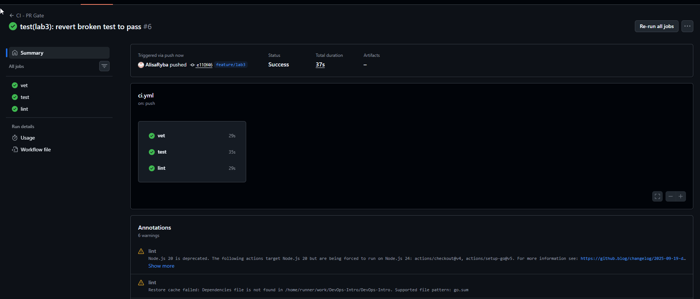
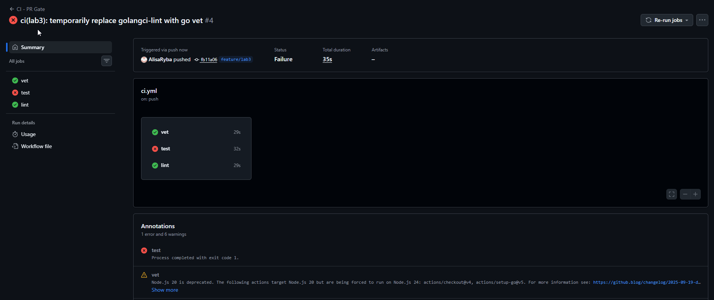
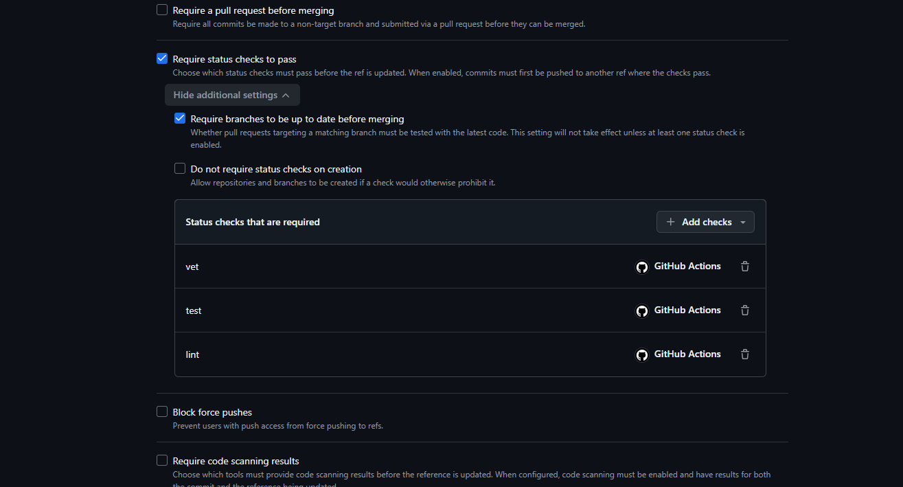
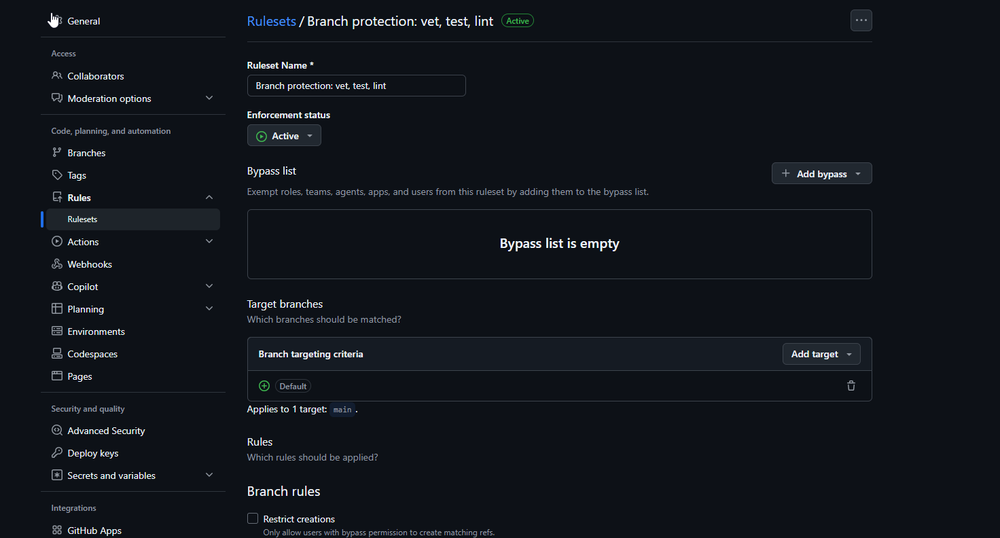

## 1. CI Platform Choice

**Path picked:** GitHub Actions

**Reason:** The course repository is hosted on GitHub, and GitHub Actions integrates seamlessly with pull requests, branch protection rules, and the overall GitHub ecosystem. It requires no additional setup or external accounts, making it the most straightforward choice for this lab. GitHub Actions also provides excellent visibility into CI status directly on the PR page.

---

## 2. Green CI Run

**Link to a successful CI run:**

[https://github.com/AlisaRyba/DevOps-Intro/actions/runs/30217149695](https://github.com/AlisaRyba/DevOps-Intro/actions/runs/30217149695)

**Screenshot:**



All three jobs (`vet`, `test`, `lint`) passed successfully.

## 3. Failed Run (Intentional Breakage)

### 3.1: Breaking the Test

To verify that the CI gate works, I intentionally broke the test in `app/health_test.go`:

**Change made:**

```go
// Before (passing)
if response["status"] != "ok" {
    t.Errorf("expected status 'ok', got '%v'", response["status"])
}

// After (failing)
if response["status"] != "broken" {
    t.Errorf("expected status 'broken', got '%v'", response["status"])
}

```



--- FAIL: TestHealthHandler (0.00s)
health_test.go:39: expected status 'broken', got 'ok'
FAIL
exit status 1
FAIL quicknotes 2.555s

## Fix Commit

test(lab3): revert broken test to pass
Commit e110f46

## Branch Protection Configuration




## Design Questions (1.2)

### Why pin the runner version (ubuntu-24.04) instead of ubuntu-latest?

Pinning the runner version ensures reproducible builds. ubuntu-latest changes over time (e.g., from 22.04 to 24.04), which can introduce breaking changes in system libraries, tools, or Go version behavior. This can cause builds that passed yesterday to fail today without any code change, leading to non-reproducible CI results. Using a fixed version guarantees that the CI environment remains consistent over time.

### Why split vet + test + lint into separate units?

Splitting into separate jobs provides better visibility and faster feedback:

If all three were in one job and vet failed, test and lint wouldn't run, hiding additional failures

With separate jobs, all checks run in parallel, and you can see exactly which check failed

It enables retrying only the failed job instead of the entire pipeline

It makes the PR status page clearer: each job shows its own status independently

### What real attack does SHA pinning prevent? (GitHub path)

SHA pinning prevents supply chain attacks where a malicious actor compromises a GitHub Action repository and pushes a malicious update to a tag (e.g., v4.2.2).

Real incident: In October 2022, the reviewdog/action-... repository was compromised, demonstrating how compromised actions could steal secrets. The attacker injected malicious code into a tag that many projects used, potentially exposing CI/CD secrets.

SHA pinning ensures you run exactly the code you reviewed, not a potentially malicious update pushed to a tag after your review. It provides cryptographic guarantee that the action code hasn't changed.

### What is permissions: and what's the principle behind it?

permissions: defines which GitHub API scopes the workflow is allowed to use. It restricts what the workflow can do on the repository.

The principle is least privilege — grant only the minimum permissions required for the job to function. For a CI pipeline:

contents: read is needed to read the repository code

No write permissions are needed

Why it matters: If the workflow is compromised or a malicious dependency is introduced, limited permissions prevent attackers from accessing repository secrets, modifying code, opening PRs, or pushing changes. This limits the blast radius of potential attacks.

### What's the difference between a stage and a job? (GitLab path — N/A for GitHub)

This question applies to GitLab CI, which I did not use in this lab.

### Timing Measurements

| Scenario                                       | Wall-clock time | Notes                      |
| ---------------------------------------------- | --------------- | -------------------------- |
| Baseline (no cache, single Go, no path filter) | ~80s            | From initial CI run        |
| With cache                                     | ~75s            | Cache added via setup-go   |
| With cache + matrix                            | ~90s            | 6 jobs running in parallel |

**Analysis:**

The caching optimization provided minimal improvement (~5s) because QuickNotes has **no external dependencies** (`go.mod` has no `require` block). The majority of the time (~60-70s) is spent on runner provisioning, checkout, and Go toolchain download — none of which `setup-go` cache affects.

For a real project with many dependencies, the improvement would be much more significant. The matrix addition increased total wall-clock time because more jobs are running, but they run **in parallel**, so the total time is roughly the same as the longest single job.

**Per-step comparison:**

| Step     | Without cache | With cache |
| -------- | ------------- | ---------- |
| Setup Go | ~30s          | ~25s       |
| go test  | ~15s          | ~12s       |
| Total    | ~80s          | ~75s       |

### f) Why cache go.sum-keyed inputs and not build outputs?

Caching `go.sum`-keyed inputs ensures that the cache is **deterministic**. `go.sum` contains cryptographic hashes of all dependencies, so any change in dependencies changes the cache key. Build outputs (binaries, compiled packages) can vary based on the environment (OS, architecture, Go version, compiler flags). By keying the cache on inputs rather than outputs, we guarantee that the cache is valid and reproducible, avoiding subtle bugs from stale build artifacts.

---

### g) What does `fail-fast: false` change in a matrix run, and when do you actually want `fail-fast: true`?

`fail-fast: false` **disables** the default behavior where a matrix run stops all other jobs when one fails. With `fail-fast: false`, all jobs continue to run even if one fails.

**When you want `fail-fast: true` (default):**

- In a critical production pipeline where speed matters more than complete feedback
- When you have many matrix jobs and want to save resources

**When you want `fail-fast: false`:**

- During debugging and testing
- When you need to see **all** failures across all combinations
- When you need to know which Go version/OS combo is failing

For our lab, `fail-fast: false` helps us see if the test passes on Go 1.23 but fails on Go 1.24, providing complete feedback.

---

### h) What's the risk of an attacker writing a cache from a malicious PR that protected branches later read?

**Risk:** An attacker could submit a malicious PR that writes poisoned cache entries. If the cache is later used in a protected branch (like `main`), the attacker could inject malicious code or alter build outputs without directly modifying the source code.

**GitHub mitigations:**

1. **Cache isolation by branch/ref:** GitHub caches are scoped to the branch/ref where they were created. A cache created in a PR branch is **not available** to other branches like `main`.
2. **Cache restore keys:** Actions can restrict which cache entries can be restored, preventing cross-branch cache poisoning.
3. **Write permissions:** GitHub Actions requires write permissions to create cache entries, which is controlled by the `permissions:` setting.
4. **GitHub's official docs:** "Caches are scoped to a branch and are isolated between branches. This means that a cache created in a pull request will not be available in the main branch."
